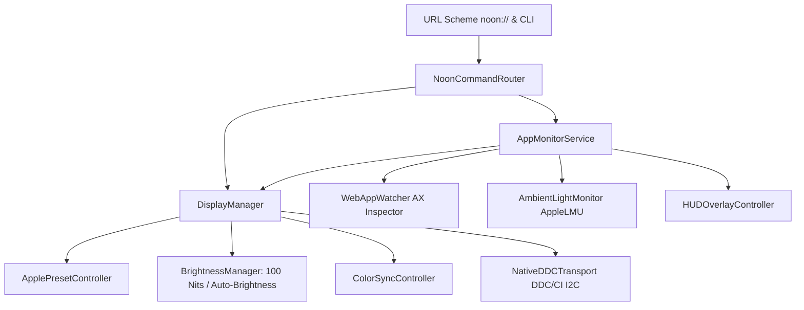

# Extended Display Engine & Creative Fidelity Architecture

## 1. Architecture Overview
Noon now features a **hardware-level Display & Creative Color Fidelity Engine** alongside its core True Tone and Night Shift automation:

---

## 2. Key Modules Delivered

### 2.1 Hardware Drivers & Transport
- **[`DDCTransport.swift`](file:///Users/damien/Developpement/Noon/Noon/Services/DDCTransport.swift)**:
  - Formats standard DDC/CI packets (`makeSetVCPPacket`, `makeGetVCPPacket`, `computeChecksum`, `parseGetVCPReply`).
  - Supports external monitors connected via DisplayPort / HDMI / USB-C using dynamic `IOAVServiceWriteI2C` / `IOAVServiceReadI2C` without external binary dependencies.
- **[`ApplePresetController.swift`](file:///Users/damien/Developpement/Noon/Noon/Services/ApplePresetController.swift)**:
  - Automatically queries and switches reference presets on Apple Pro Display XDR and Liquid Retina XDR displays (`Photography (P3-D65)`, `Design & Print (P3-D50)`, `Digital Cinema (P3-DCI)`, `HDTV Video (BT.709)`).
  - Detects hardware luminance locks and restores factory presets on exit.
- **[`ColorSyncController.swift`](file:///Users/damien/Developpement/Noon/Noon/Services/ColorSyncController.swift)**:
  - Dynamically changes and restores display ICC profiles using `ColorSyncDeviceCopyDeviceInfo` and `ColorSyncDeviceSetCustomProfiles`.
- **[`BrightnessManager.swift`](file:///Users/damien/Developpement/Noon/Noon/Services/BrightnessManager.swift)**:
  - Computes and sets **Apple Recommended Calibrated Luminance**: 100 nits SDR reference for XDR displays, 50% slider (~120 nits) for standard Retina displays.
  - Automatically disables macOS ambient auto-brightness during creative tasks and restores original states seamlessly.

### 2.2 Orchestration & UI
- **[`DisplayManager.swift`](file:///Users/damien/Developpement/Noon/Noon/Services/DisplayManager.swift)**:
  - `@Observable @MainActor` coordinator for multi-display environments.
  - Supports per-display granular targeting and user exclusion toggles with persistent override storage.
- **[`WebAppWatcher.swift`](file:///Users/damien/Developpement/Noon/Noon/Services/WebAppWatcher.swift)**:
  - Inspects active browser windows via macOS Accessibility (`AXUIElement`) for Safari, Chrome, Arc, Edge, Brave, Firefox, and Opera.
  - Automatically triggers Creative Mode when using web-based design tools (**Figma**, **Photopea**, **Canva**, **Spline**).
- **[`AmbientLightMonitor.swift`](file:///Users/damien/Developpement/Noon/Noon/Services/AmbientLightMonitor.swift)**:
  - Reads physical ambient illuminance via `AppleLMU` IOKit service.
  - Alerts users if environmental lighting drifts by more than 30% from baseline, warning against compromised visual color perception.
- **[`HUDOverlayController.swift`](file:///Users/damien/Developpement/Noon/Noon/Services/HUDOverlayController.swift)** & **[`DynamicHUDView.swift`](file:///Users/damien/Developpement/Noon/Noon/Views/Components/DynamicHUDView.swift)**:
  - Floating non-activating notch/menu bar badge providing instant visual confirmation of color calibration and ambient status with glassmorphic styling.
- **[`DisplaysTab.swift`](file:///Users/damien/Developpement/Noon/Noon/Views/Settings/DisplaysTab.swift)**:
  - Dedicated tab in `SettingsView` displaying detected screens, XDR badges, DDC/CI status, 100 nits calibration lock, ambient light monitoring, and web app detection toggles.
- **[`NoonCommandRouter.swift`](file:///Users/damien/Developpement/Noon/Noon/Services/NoonCommandRouter.swift)** & **[`NoonApp.swift`](file:///Users/damien/Developpement/Noon/Noon/App/NoonApp.swift)**:
  - Custom URL Scheme handler (`noon://toggle`, `noon://enable`, `noon://calibrate`, `noon://preset`) and companion CLI argument parser.

---

## 3. Test Suite Verification
All **41 automated tests** passed with 0 failures:
- **`DDCPacketTests`** (5 tests): Packet creation, checksum XOR, reply parsing, Mock transport.
- **`AppleReferencePresetTests`** (3 tests): Nominal luminance math, hardware locks, preset restoration.
- **`CalibratedBrightnessTests`** (4 tests): 100 nits SDR math on XDR, 50% slider on Retina, hardware lock bypass.
- **`ColorSyncControllerTests`** (2 tests): ICC profile listing, switching, and restoration.
- **`DisplayManagerOrchestrationTests`** (1 test): Per-display targeting and exclusion rules.
- **`WebAppWatcherTests`** (2 tests): URL and title pattern recognition for design web applications.
- **`AmbientLightMonitorTests`** (1 test): AppleLMU baseline polling and drift threshold alerts.
- **`NoonCommandRouterTests`** (2 tests): `noon://` URL scheme & CLI argument parser.
- **`IntegratedDisplaysUITests`** (3 tests): `AppSettings` display flags, `DisplaysTab` rendering, `HUDOverlayController` lifecycle.
- **Legacy & UI Suites** (18 tests): True Tone, Night Shift, menu bar states, glass cards, settings views, UI launch tests.
