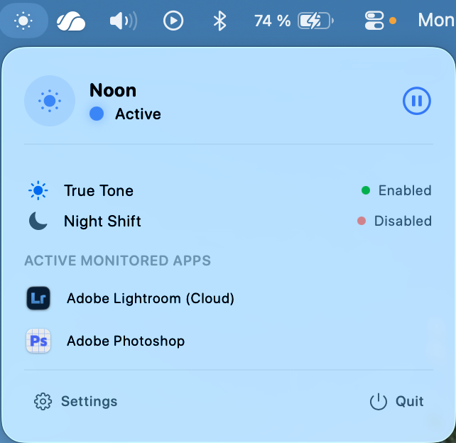
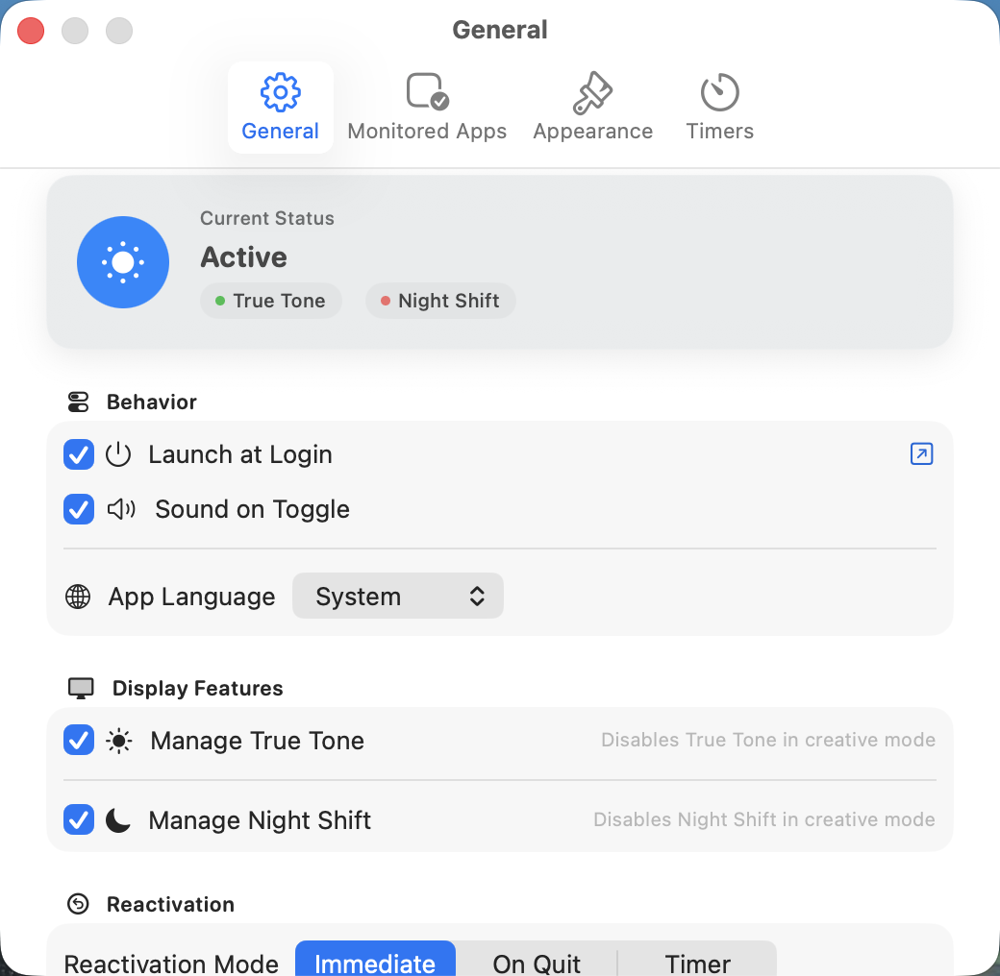
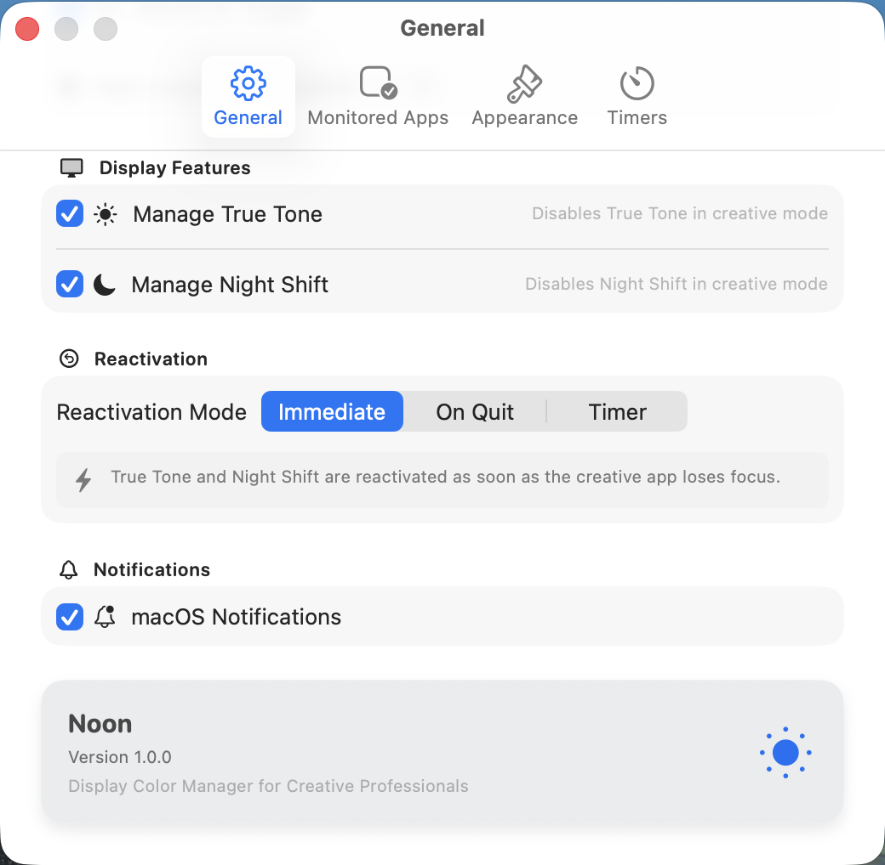
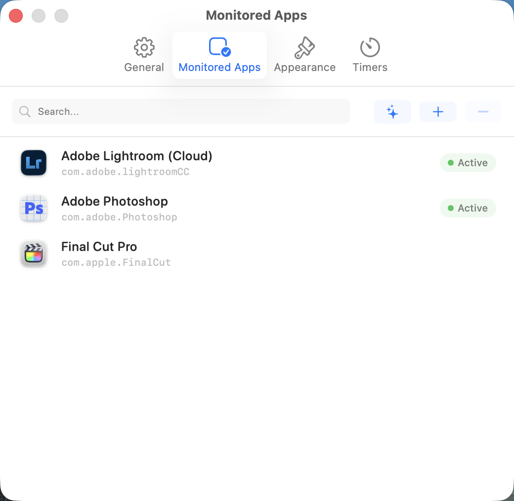
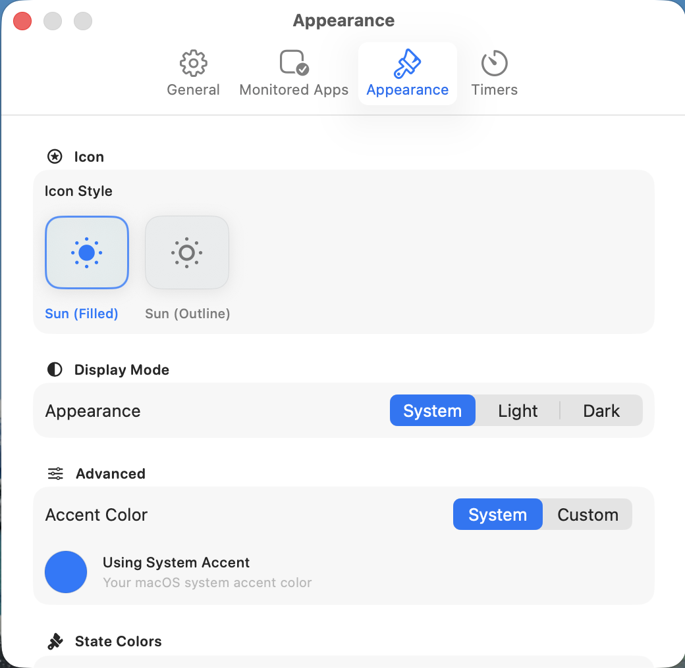
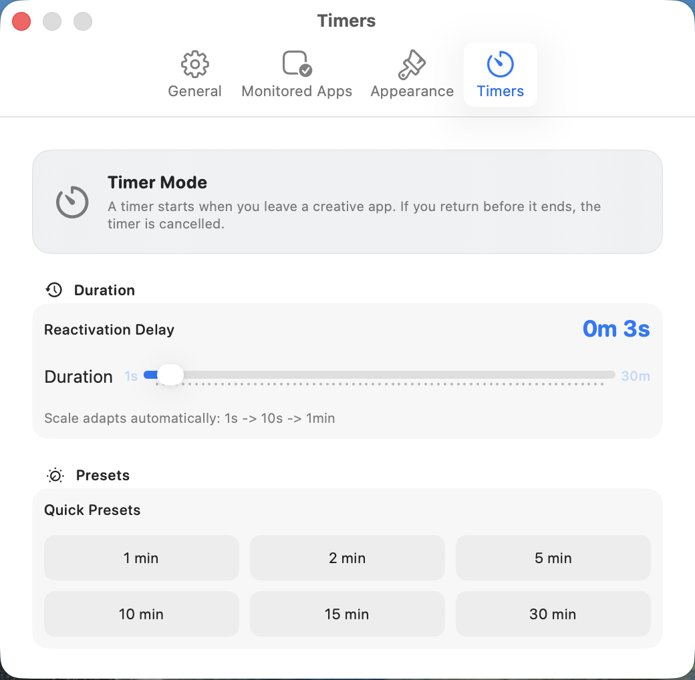

# ☀️ Noon

**Professional Display Accuracy for Creative macOS Workflows**

Noon is a premium macOS utility designed for photographers, colorists, and designers. It ensures a 100% color-accurate environment by dynamically managing **True Tone** and **Night Shift** based on the active professional applications in your workflow.

---

## 🚀 Key Features

### 🎯 Intelligent App Monitoring
Noon monitors your foreground applications in real-time. When a creative tool (e.g., Photoshop, DaVinci Resolve, Lightroom) is active, Noon instantly disables display tinting to guarantee color fidelity.

### ⏱ Adaptive Reactivation Timer
Noon features a smart duration logic to avoid flickering when switching briefly between apps. The delay is fully customizable from **1 second to 30 minutes** with an adaptive scale for maximum precision:
- **1s to 15s**: 1-second increments.
- **20s to 5min**: 10-second increments.
- **6min to 30min**: 1-minute increments.

### 🎨 Personalized Experience
- **Sound on Toggle**: Receive satisfying audio feedback whenever Noon switches your display mode.
- **Adaptive Iconography**: The Menu Bar icon sub-updates its appearance (filled/outline) to indicate whether a creative mode is active at a glance.
- **Smart Auto-Detection**: Noon automatically recognizes industry-standard apps like Adobe Creative Cloud, DaVinci Resolve, and Final Cut Pro right out of the box.

### 🛠 Technical Excellence
- **Objective-C Bridge**: Interfaces with Apple's private `CoreBrightness.framework` via a robust bridging header, providing low-level, hardware-synchronized control over True Tone and Night Shift.
- **Dynamic Dock Visibility**: To maintain a clean workspace, Noon operates as a Menu Bar extra. The Dock icon appears dynamically **only** when the Settings window is in focus, utilizing AppKit's activation policy (Accessory mode by default).
- **Glassmorphism UI**: Built exclusively with SwiftUI using modern material effects (Ultra Thin Material) to match the macOS Sequoia design language.

---

## 📸 Visual Walkthrough

<details>
<summary><b>Click to expand screenshots</b></summary>

| | | |
|:---:|:---:|:---:|
| **Main Menu** | **General Settings (1)** | **General Settings (2)** |
|  |  |  |
| **Monitored Apps** | **Appearance** | **Timers** |
|  |  |  |

</details>

---

## 📦 Installation

### GitHub Releases
1. Download the latest `.dmg` from the [Releases](https://github.com/Damien-Esilv/Noon/releases) page.
2. Drag **Noon** to your Applications folder.
3. Launch and grant necessary system permissions.

### Homebrew Cask 
Install via Homebrew with a single command:
```bash
brew install --cask damien-esilv/noon/noon
```

---

## 🛡️ Security & macOS Gatekeeper

Since Noon is signed using a **Personal Team (Free)** certificate, macOS may block the initial launch with a security warning. This is expected behavior for independent open-source projects.

To run Noon:
1. Open **System Settings** > **Privacy & Security**.
2. Scroll down to the **Security** section.
3. Look for the message: *"Noon was blocked from use because it is not from an identified developer."*
4. Click **"Open Anyway"**.
5. Enter your Mac password to confirm.

---

## 📄 License & Copyright
**Copyright © 2026 Sunazur. All rights reserved.**

Licensed under the **Creative Commons Attribution-NonCommercial-ShareAlike 4.0 International (CC BY-NC-SA 4.0)**.

For full details, see the [LICENSE](LICENSE) file.
