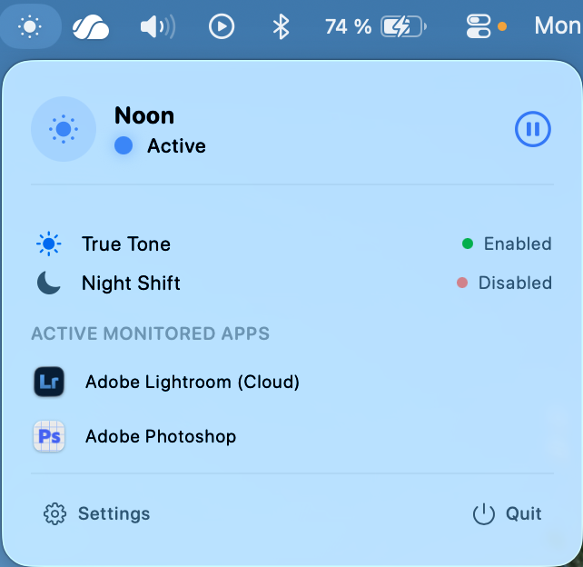
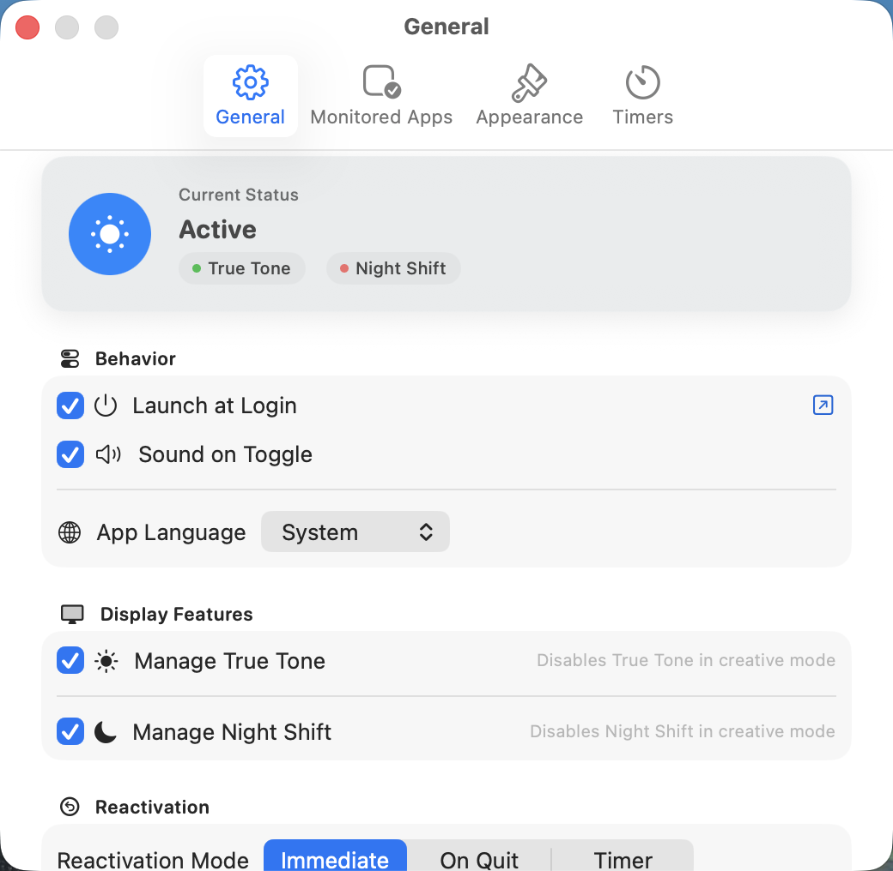
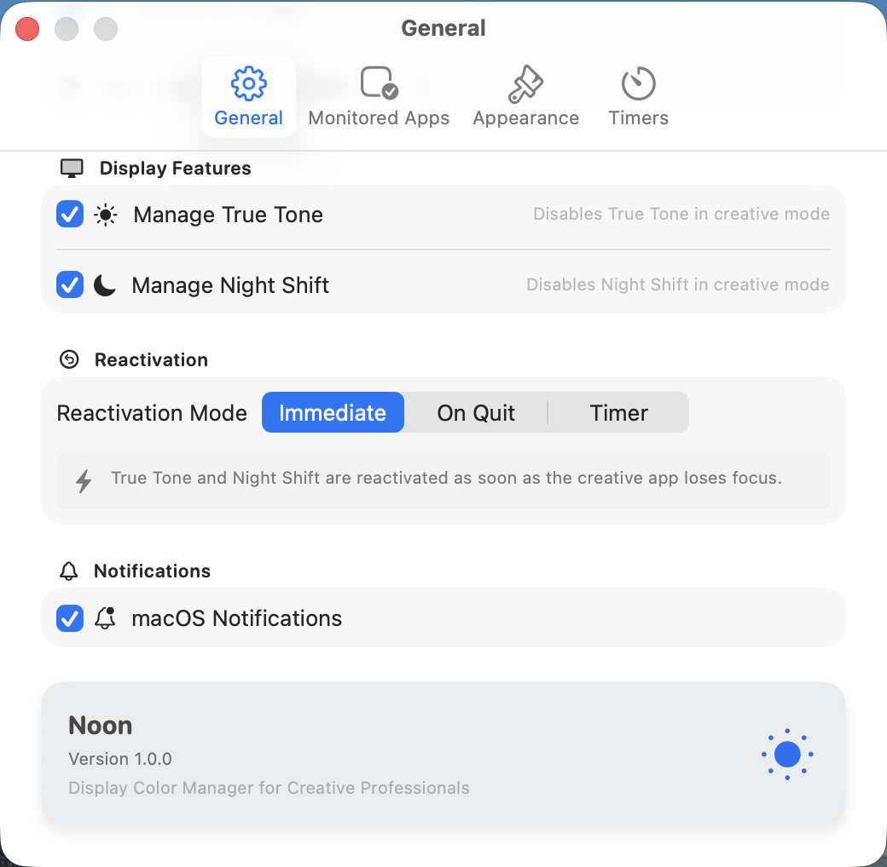
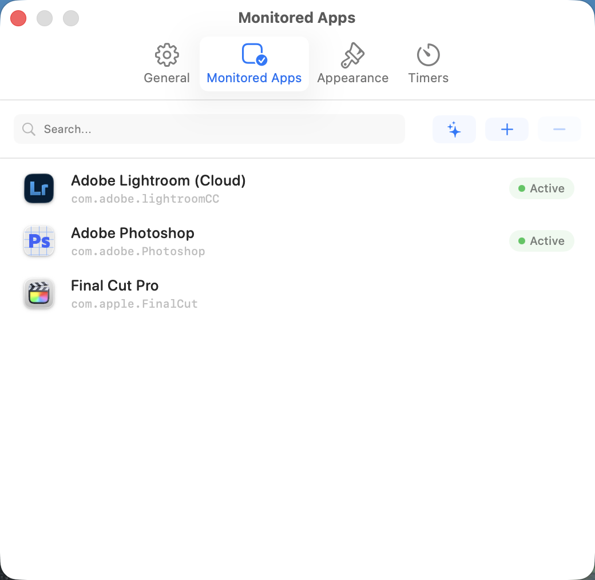
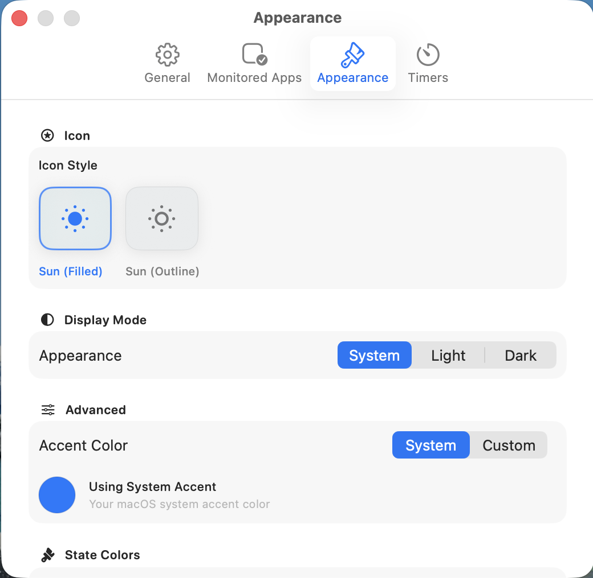
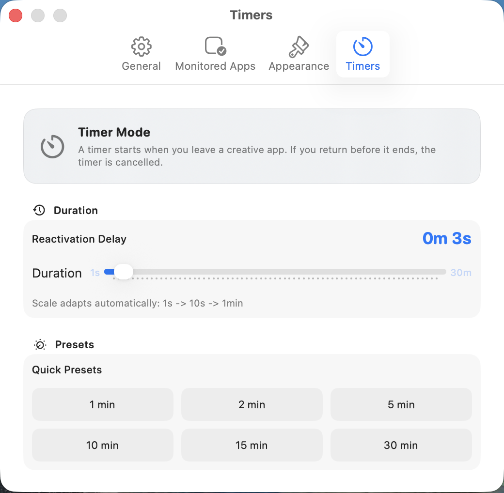

# ☀️ Noon

**Professional Display Accuracy & Color Fidelity for macOS Workflows**

Noon is a premium macOS utility designed for photographers, colorists, digital artists, and designers. It guarantees a 100% color-accurate studio environment by dynamically managing **True Tone**, **Night Shift**, **Apple XDR Reference Presets**, **ColorSync Profiles**, **Display Luminance (100 Nits SDR Studio Reference)**, and **External Monitor DDC/CI Hardware Presets** based on the active creative tools in your workflow.

---

## 🚀 Key Features

### 🎯 Intelligent Creative App & Web Tool Monitoring
- **Native Applications**: Real-time foreground process inspection recognizes Photoshop, Lightroom, DaVinci Resolve, Final Cut Pro, Illustrator, Blender, Affinity Suite, and custom user-defined apps.
- **Web Creative Tools**: Automatically detects design sessions in web browsers (Safari, Chrome, Arc, Edge, Brave, Firefox) for **Figma**, **Canva**, **Photopea**, and **Spline**.

### 🖥️ Extended Display & Hardware Calibration Engine
- **Apple Pro Display XDR & Liquid Retina XDR Presets**: Dynamically switches reference presets (`Photography P3-D65`, `Design & Print P3-D50`, `Digital Cinema P3-DCI`, `HDTV Video BT.709`) and detects hardware luminance locks.
- **External Monitor Hardware DDC/CI Control**: Transmits standard DDC/CI commands over I2C (`IOAVService`) to calibrate external screens without third-party tools.
- **ColorSync Profile Management**: Switches and restores display ICC profiles (`Display P3`, `sRGB`, `Adobe RGB (1998)`).
- **100 Nits SDR Studio Calibration Lock**: Locks calibrated reference luminance (100 nits on XDR displays, 50% slider on Retina displays) and overrides macOS ambient auto-brightness during critical color tasks.
- **Multi-Display Selective Targeting**: Manage each display individually or exclude secondary monitors directly from the Displays tab.

### 💡 AppleLMU Ambient Light Drift Monitoring
- Interfaces directly with macOS ambient light sensors (`AppleLMU`).
- Establishes a lighting baseline upon entering Creative Mode and alerts you if ambient light changes by more than 30%, preventing perception errors caused by room lighting drift.

### 🔔 Dynamic Notch & Menu Bar HUD
- A floating, non-activating glassmorphic badge appears under the MacBook notch or menu bar to confirm active color profiles, calibration targets, and ambient light stability.

### ⚡ Automation & URL Scheme
- Control Noon via the `noon://` custom URL scheme or CLI:
  ```bash
  open "noon://toggle"
  open "noon://enable?app=Photoshop"
  open "noon://preset?name=photography"
  open "noon://calibrate?mode=recommended"
  ```

### ⏱️ Adaptive Reactivation Timer
Noon features customizable cooldown intervals to avoid display flickering when switching briefly between tasks:
- **1s to 15s**: 1-second increments.
- **20s to 5min**: 10-second increments.
- **6min to 30min**: 1-minute increments.

### 🎨 Modern macOS Sequoia Design
- Built entirely with modern SwiftUI and Ultra Thin Material glassmorphism.
- Accessory Menu Bar app by default with dynamic Dock appearance when Settings are displayed.
- Dynamic Menu Bar icon states (filled / outline) reflecting active calibration.

---

## 📸 Visual Walkthrough

<details open>
<summary><b>Click to expand screenshots</b></summary>

| | | |
|:---:|:---:|:---:|
| **Main Menu** | **General Settings (1)** | **General Settings (2)** |
|  |  |  |
| **Monitored Apps** | **Appearance** | **Timers** |
|  |  |  |

</details>

---

## 📦 Installation

### Direct Download
1. Download the latest release from the [Releases](https://github.com/Damien-Esilv/Noon/releases) page.
2. Drag **Noon.app** to your `/Applications` folder.
3. Launch Noon and grant Accessibility permissions when prompted (required for browser web-app detection).

### Build from Source
```bash
git clone https://github.com/Damien-Esilv/Noon.git
cd Noon
xcodebuild -scheme Noon -configuration Release build
```

---

## 🛡️ Security & macOS Gatekeeper

Since Noon is signed using a **Personal Team (Free)** certificate, macOS may block the initial launch with a security warning. This is expected behavior for independent open-source projects.

To run Noon:
1. Open **System Settings** > **Privacy & Security**.
2. Scroll down to the **Security** section.
3. Look for the message: *"Noon was blocked from use because it is not from an identified developer."*
4. Click **"Open Anyway"**.
5. Enter your Mac password to confirm.

---

## 📄 License & Copyright
**Copyright © 2026 Sunazur. All rights reserved.**

Licensed under the **Creative Commons Attribution-NonCommercial-ShareAlike 4.0 International (CC BY-NC-SA 4.0)**.

For full details, see the [LICENSE](LICENSE) file.
